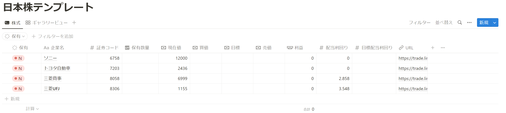

# Notion_Stock

## 概要

Notionで管理している株式データベースに現在の株価, 配当利回りを反映させる

- notion API
- LINE証券API

を利用している

## Notion

Notion API を使用するには
[Notion APIを使用したインテグレーションの作成](https://www.notion.so/ja-jp/help/create-integrations-with-the-notion-api)
を参考にインテグレーションを作成してからトークンを取得してから、

[APIコネクトの追加・管理](https://www.notion.so/ja-jp/help/add-and-manage-connections-with-the-api)
を参考にAPIコネクトをページに追加する必要がある。

今回のコードのためのnotionデータベースは以下のようなもので



[テンプレート](https://burnt-lipstick-daa.notion.site/Github-e1a8ec9861a74798b78cb27895e06b74?pvs=4)
にnotionのテンプレートをおいておきます。自分でいろいろと書き換えてください。

## 使い方

```python
$ python notion.py
```

で実行すれば、notionの株式データベースが更新されます。

## TODO

notionのデータベースも書き換える必要があるが、PERやPBRなどのデータも取得して書き換えたり、

証券コードと取得単価を簡単に入力できるフォームを用意し、平均取得単価なども表示できるようにする。

2023/08/29

LINE証券の廃止が決定されたので将来的にLINE証券のAPIが使えなくなる
